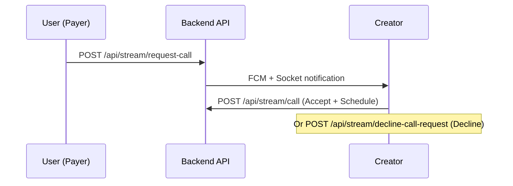
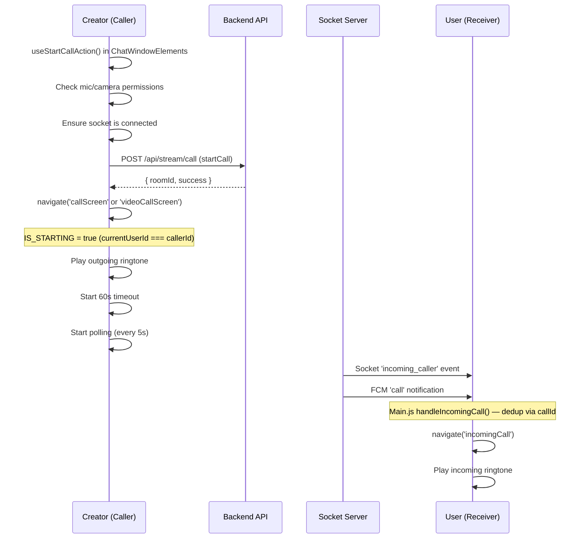
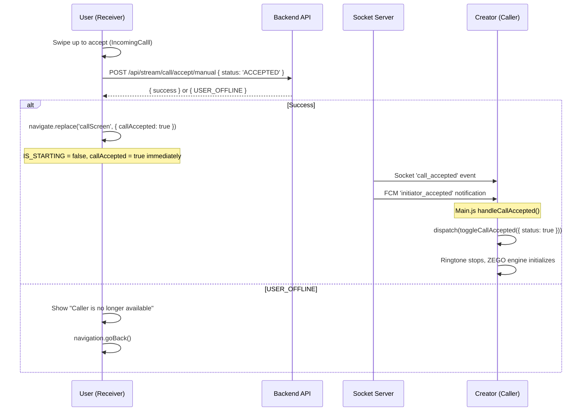
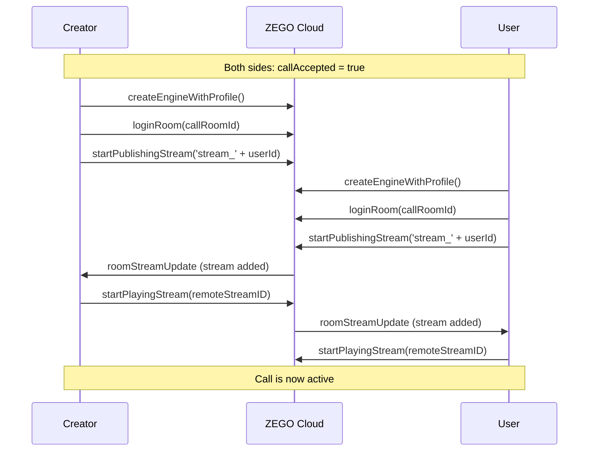
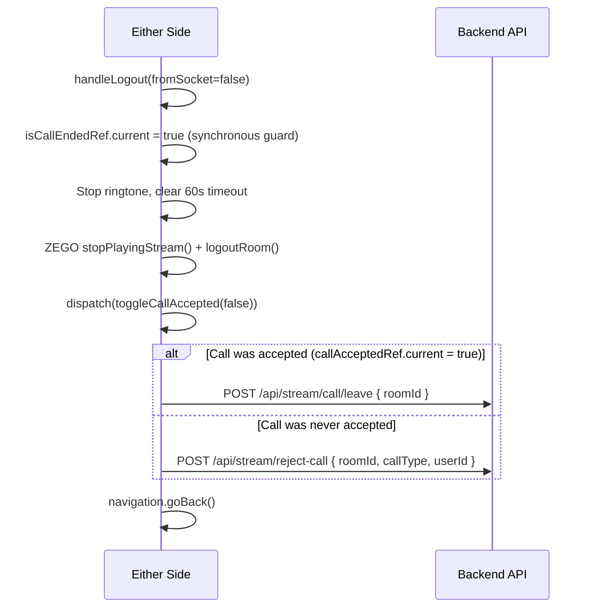

# Fahdu Call System — Complete Architecture Reference

## File Map

| File | Role |
|------|------|
| [Main.js](file:///Users/giniedigital/Documents/fahdu79/Main.js) | Central hub: socket listeners, FCM handlers, incoming call routing, call accepted/rejected/disconnected handling |
| [CallScreen.js](file:///Users/giniedigital/Documents/fahdu79/Src/Components/Calling/CallScreen.js) | Audio call screen (caller + receiver) — ZEGO audio engine, polling, ringtone, 60s timeout |
| [VideoCallScreen.js](file:///Users/giniedigital/Documents/fahdu79/Src/Components/Calling/VideoCallScreen.js) | Video call screen — same pattern as CallScreen but with camera, local/remote video views, tipping |
| [IncomingCalll.js](file:///Users/giniedigital/Documents/fahdu79/Src/Components/Calling/IncomingCalll.js) | Incoming call UI — swipe-to-answer, decline, 60s safety timeout, ringtone |
| [useCallStatusPolling.js](file:///Users/giniedigital/Documents/fahdu79/Src/Components/Calling/useCallStatusPolling.js) | Polling hook — polls backend for call status changes (ACCEPTED/REJECTED/UNAVAILABLE/DISCONNECTED/FORCE_CLOSED) |
| [RingtoneManager.js](file:///Users/giniedigital/Documents/fahdu79/Src/Components/Calling/RingtoneManager.js) | Singleton ringtone player — uses `expo-audio` for incoming/outgoing ringtones |
| [CallingStatusText.js](file:///Users/giniedigital/Documents/fahdu79/Src/Components/Calling/CallingStatusText.js) | Animated "Calling..." status text with rotating messages and dot animation |
| [TimerText.js](file:///Users/giniedigital/Documents/fahdu79/Src/Components/Calling/TimerText.js) | Call duration timer (shown after acceptance) |
| [CallingTip.js](file:///Users/giniedigital/Documents/fahdu79/Src/Components/Calling/CallingTip.js) | In-call tipping UI (video calls) |
| [CallDisconnectedModal.js](file:///Users/giniedigital/Documents/fahdu79/Src/Components/Calling/CallDisconnectedModal.js) | Modal shown when other party swipe-closes app |
| [MicPermissionModal.js](file:///Users/giniedigital/Documents/fahdu79/Src/Components/Calling/MicPermissionModal.js) | Permission request modal for mic/camera |
| [NetworkQualityBadge.js](file:///Users/giniedigital/Documents/fahdu79/Src/Components/Calling/NetworkQualityBadge.js) | Network quality indicator in call header |
| [CallDebugConsole.js](file:///Users/giniedigital/Documents/fahdu79/Src/Components/Calling/CallDebugConsole.js) | Debug console showing polling logs (dev only) |
| [PollingLogManager.js](file:///Users/giniedigital/Documents/fahdu79/Src/Components/Calling/PollingLogManager.js) | Global polling log store with reactive subscribers |
| [CallRequestModal.js](file:///Users/giniedigital/Documents/fahdu79/Src/Components/ChatWindowComponents/CallRequestModal.js) | Modal for accepting/denying a scheduled call request |
| [ChatWindowElements.js](file:///Users/giniedigital/Documents/fahdu79/Src/Components/ChatWindowComponents/ChatWindowElements.js) | Contains `useStartCallAction` hook — initiates calls from chat window |
| [CallSlice.js](file:///Users/giniedigital/Documents/fahdu79/Redux/Slices/NormalSlices/Call/CallSlice.js) | Redux slice: `processedRoomIds`, `acceptedRoomIds`, dedup tracking |
| [HideShowSlice.js](file:///Users/giniedigital/Documents/fahdu79/Redux/Slices/NormalSlices/HideShowSlice.js) | Redux slice containing `callAccepted` boolean |
| [chatWindowAttachmentSliceApi.js](file:///Users/giniedigital/Documents/fahdu79/Redux/Slices/QuerySlices/chatWindowAttachmentSliceApi.js) | RTK Query API definitions for all call endpoints |
| [SocketServices.js](file:///Users/giniedigital/Documents/fahdu79/SocketServices.js) | Socket.io client — connects to `api.fahdu.in`, handles reconnection |
| [StackNavigation.js](file:///Users/giniedigital/Documents/fahdu79/Navigation/StackNavigation.js) | Screen registration: `callScreen`, `videoCallScreen`, `incomingCall` |
| [ZegoConfig.js](file:///Users/giniedigital/Documents/fahdu79/Src/Configs/ZegoConfig.js) | ZEGO App ID and App Sign |

---

## Backend API Endpoints

| Endpoint | Method | Purpose | Used In |
|----------|--------|---------|---------|
| `/api/stream/call` | POST | Accept a scheduled call request and start call | CallRequestModal, CallRequestsScreen |
| `/api/stream/request-call` | POST | Send a new call request | Not found in calling components |
| `/api/stream/call/token?roomId=` | GET | Get ZEGO token for a call room | CallScreen, VideoCallScreen |
| `/api/stream/call/renew-token?roomId=` | GET | Renew expired ZEGO token | CallScreen, VideoCallScreen |
| `/api/stream/call/accept/manual` | POST | Accept/Reject/Mark-Unavailable a call (`status: ACCEPTED/REJECTED/UNAVAILABLE`) | IncomingCalll, CallScreen (60s timeout) |
| `/api/stream/call/leave` | POST | Leave an active call (graceful end) | CallScreen, VideoCallScreen |
| `/api/stream/reject-call` | POST | Reject an incoming call | CallScreen, VideoCallScreen |
| `/api/stream/other/participant/status?roomId=` | GET | Poll the other participant's status | useCallStatusPolling |
| `/api/stream/call/status?roomId=` | GET | Check call tries status | CallRequestsScreen |
| `/api/stream/decline-call-request` | POST | Decline a scheduled call request | CallRequestModal, ChatWindowElements |
| `/api/stream/update/availability` | POST | Update call availability | Settings |
| `/api/fee-setup/get-fees?userId=` | GET | Get creator's calling fees | ChatWindowInformationModal |

---

## Socket Events

### Emitted by Client
| Event | Payload | When |
|-------|---------|------|
| `initiateConnection` | `currentUserId` | On socket connect/reconnect |
| `client_ping` | `{ time }` | Every 30s heartbeat (volatile) |

### Received from Server
| Event | Payload | Handler Location | Action |
|-------|---------|-----------------|--------|
| `incoming_caller` | `{ roomId, callId, name, profileImageUrl, callType, callerId }` | Main.js `onIncomingCaller` | Navigate to `incomingCall` screen |
| `call_accepted` | `{ roomId }` | Main.js `onCallAccepted` | Dispatch `toggleCallAccepted(true)`, toast |
| `call_rejected` | `{ by, callId }` | Main.js `onCallRejected` | Stop ringtone, navigate home, toast |
| `call_unavailable` | `{ callId }` | Main.js `onCallUnavailable` | Stop ringtone, navigate home, toast |
| `call_disconnected` | `{ callId }` | Main.js `onCallDisconnected` | Stop ringtone, navigate home |
| `socket_disconnect_close_app` | `{ callId }` | Main.js `onSocketDisconnectCloseApp` | Stop ringtone, show `CallDisconnectedModal` |
| `call_tip` | `{ amount, ... }` | Main.js `onCallTip` | Dispatch tip to Redux for in-call UI |

### FCM Notification Types (handled in Main.js `onMessageReceived`)
| Type | Action |
|------|--------|
| `call` | Same as `incoming_caller` socket — navigates to incoming call |
| `initiator_accepted` | Same as `call_accepted` socket — dispatches call accepted |
| `call_rejected` | Stop ringtone, reset state, navigate home |
| `call_completed` | Show notification |
| `fcm_disconnect_close_app` | Same as `socket_disconnect_close_app` |
| `call_disconnected` | Same as socket `call_disconnected` |
| `missed_call` | Show notification |
| `call_request` / `call_request_accepted` | Show notification |
| `10_reminder` / `5_reminder` / `1_reminder` | Show call reminder notification |

---

## Redux State

### `state.hideShow.visibility.callAccepted` (boolean)
- **`true`**: Call has been accepted, ZEGO engine should initialize, ringtone should stop
- **`false`**: Default / call ended / not yet accepted
- Controlled by `toggleCallAccepted({ status: true/false })`

### `state.call.processedRoomIds` (string[])
- Tracks `callId`s that have already been routed to `incomingCall` screen
- Prevents duplicate navigation when both Socket and FCM deliver the same call event
- Cleared via `clearProcessedRoomId(callId)` after call ends
- Max size: 20 entries (FIFO)

### `state.call.acceptedRoomIds` (string[])
- Tracks `roomId`s where `call_accepted` has already been processed
- Prevents duplicate `toggleCallAccepted(true)` dispatches
- Cleared via `clearAcceptedRoomId(roomId)` on CallScreen unmount

---

## Complete Call Lifecycle

### Phase 1: Call Request (Scheduled Calls Only)



- User sends a call request from chat window or profile
- Creator sees `CallRequestModal` or scheduled call in `CallRequestsScreen`
- Creator accepts and schedules a time
- Chat shows `REQUEST_SENT` → `CALL_SCHEDULED` message bubbles

---

### Phase 2: Call Initiation (Creator Calls)



**Creator-side CallScreen on mount:**
1. `IS_STARTING = true` (creator is the caller)
2. Plays outgoing ringtone via `RingtoneManager.playOutgoing()`
3. Starts 60-second timeout — if not accepted, sends `UNAVAILABLE` API call
4. Starts polling via `useCallStatusPolling` (every 5s until accepted, then 8s)
5. Waits for `callAccepted` to become `true` before initializing ZEGO engine
6. Does NOT dispatch `toggleCallAccepted(true)` itself — waits for signal

**User-side IncomingCalll on mount:**
1. Plays incoming ringtone
2. Checks mic/camera permissions (1.5s delay to not steal audio focus)
3. 60-second safety timeout to auto-dismiss
4. Polls for caller cancellation via `useCallStatusPolling`

---

### Phase 3: Call Acceptance



**Three pathways for creator to know call was accepted:**

| Pathway | Source | Handler |
|---------|--------|---------|
| Socket | `call_accepted` event | Main.js `onCallAccepted` → `handleCallAccepted()` |
| FCM | `initiator_accepted` notification | Main.js FCM handler → `handleCallAccepted()` |  
| Polling | Status returns `ACCEPTED` | `useCallStatusPolling.onCallAccepted` → `dispatch(toggleCallAccepted(true))` |

> [!IMPORTANT]
> The polling pathway is guarded by `status === 'ACCEPTED' && !callAccepted` (line 83 of useCallStatusPolling.js). Once `callAccepted` becomes `true` from any source, polling won't re-trigger the callback.

---

### Phase 4: Active Call (ZEGO Engine)



**ZEGO Engine Init Sequence (both CallScreen and VideoCallScreen):**

1. `createEngineWithProfile({ appID, appSign, scenario })` 
2. Set `expo-av` audio mode (iOS silent mode, recording, background)
3. Attach all event listeners FIRST (before permissions — prevents race condition)
4. Request microphone (+ camera for video) permissions
5. Configure audio route to speaker
6. `loginRoom(callRoomId, { userID, userName }, roomConfig)`
7. `startPublishingStream('stream_' + currentUserId)`

**Key ZEGO Events:**
- `roomStreamUpdate`: Remote stream added/removed — play stream or show end modal
- `roomUserUpdate`: User joined/left room
- `publisherQualityUpdate`: Network quality indicator
- `roomStateUpdate`: Room connection state changes

**One-shot engine trigger (`shouldInitEngine`):**
- For the caller (IS_STARTING): starts as `false`, flips to `true` when `callAccepted` becomes true
- For the receiver: starts as `true` immediately (they already accepted)
- This prevents the ZEGO engine from being destroyed/re-created if `callAccepted` flickers

---

### Phase 5: Call Termination

#### 5a. Normal End (User presses end button)



#### 5b. 60-Second Timeout (No Answer)

Only runs on **caller (IS_STARTING) side**:

1. `setTimeout(60000)` set on mount
2. If `callAcceptedRef.current` is still `false` after 60s:
   - Module-level guard `_unavailableSentForRoom` prevents duplicates across React re-mounts
   - Calls `callAcceptManual({ status: 'UNAVAILABLE' })`
   - Shows "User not receiving the call" toast
   - Navigates away

#### 5c. Remote Stream Removed (ZEGO SDK disconnect)

When ZEGO fires `roomStreamUpdate` with `updateType === 1` (stream removed):
- Sets `endTriggerSource = 'ZEGO_SDK'`
- Dispatches `toggleCallAccepted(false)`
- Shows `StreamEndedUserModal` ("Call terminated")

#### 5d. Socket/FCM Signals

When `call_rejected`, `call_disconnected`, `call_unavailable`, or `socket_disconnect_close_app` arrives:
- Main.js handlers stop ringtone, reset state, navigate to home
- `socket_disconnect_close_app` specifically shows `CallDisconnectedModal`

#### 5e. Force-Quit (App Killed)

> [!CAUTION]
> **This is the problematic scenario.** When both sides force-quit:
> - Neither side calls `leaveCall` or `rejectCall`
> - Socket disconnects but server may not detect it immediately
> - Backend call record stays in non-terminal state
> - On app reopen, `Main.js` only does `dispatch(toggleCallAccepted(false))` — no API cleanup

#### 5f. Navigation Blur Guard

Both `CallScreen` and `VideoCallScreen` listen for the `blur` navigation event. If the screen loses focus (e.g., socket event navigates away), it calls `handleLogout(true)` to clean up.

---

## Deduplication Guards

### 1. `processedRoomIds` (Redux — CallSlice)
- **Purpose**: Prevent same incoming call from being handled twice (Socket + FCM race)
- **Key**: Uses `callId` (not `roomId`) — same across Socket and FCM for one call session
- **Set**: In `handleIncomingCall()` before navigating to `incomingCall`
- **Cleared**: In `clearProcessedRoomId(callId)` after call ends (multiple places)
- **Max size**: 20 entries (FIFO)

### 2. `acceptedRoomIds` (Redux — CallSlice)
- **Purpose**: Prevent same `call_accepted` signal from being processed twice
- **Key**: Uses `roomId`
- **Set**: In `handleCallAccepted()` 
- **Cleared**: In `clearAcceptedRoomId(roomId)` on CallScreen unmount

### 3. `_unavailableSentForRoom` (Module-level Set)
- **Purpose**: Prevent duplicate `UNAVAILABLE` API calls across React re-mounts
- **Scope**: Module-level (survives component re-mounts, React 19 double-invocations)
- **Set**: Before sending UNAVAILABLE in 60s timeout
- **Cleared**: On CallScreen unmount cleanup

### 4. `isCallEndedRef` (Component-level Ref)
- **Purpose**: Synchronous guard to prevent `handleLogout` from running twice
- **Why ref not state**: React batches state updates, so `useState` can't prevent double-entry. Refs update synchronously.

### 5. `hasNavigatedAwayRef` (Component-level Ref)
- **Purpose**: Prevent double navigation (e.g., timeout fires + socket signal arrives simultaneously)

### 6. `hasActedRef` (IncomingCalll only)
- **Purpose**: Prevent accept/decline from firing twice

---

## Ringtone Management

[RingtoneManager.js](file:///Users/giniedigital/Documents/fahdu79/Src/Components/Calling/RingtoneManager.js) is a **singleton** using `expo-audio`:

| Method | Sound File | Used By |
|--------|-----------|---------|
| `playIncoming()` | `Assets/IncomingCall.wav` | IncomingCalll |
| `playOutgoing()` | `Assets/Audio/ringfahdu.wav` | CallScreen, VideoCallScreen (caller side) |
| `stopAll()` | — | Everywhere on call end/accept |

- Uses `createAudioPlayer()` from `expo-audio` (new API)
- Sets `playsInSilentMode: true` and `shouldPlayInBackground: true`
- `stopAll()` calls `activePlayer.release()` and nulls the reference
- Only one player active at a time (`stopAll()` called before play)

---

## State Flow Summary

```
┌─────────────────────────────────────────────────────────┐
│                    Redux State                           │
│                                                          │
│  callAccepted: false ──────────────────────► true        │
│    ↑ Set on mount (Main.js line 94)     ↑ Socket/FCM/   │
│    ↑ Set on call end                     Polling signal  │
│                                                          │
│  processedRoomIds: [] ──► [callId1, callId2, ...]       │
│    Dedup guard for incoming calls                        │
│                                                          │
│  acceptedRoomIds: [] ──► [roomId1, roomId2, ...]        │
│    Dedup guard for acceptance signals                    │
└─────────────────────────────────────────────────────────┘

┌─────────────────────────────────────────────────────────┐
│                 Component Refs (CallScreen)               │
│                                                          │
│  isMounted.current         = true → false (unmount)      │
│  isCallEndedRef.current    = false → true (first end)    │
│  callAcceptedRef.current   = synced with Redux           │
│  hasNavigatedAwayRef.current = false → true (nav once)   │
│  isEngineActive.current    = false → true (ZEGO init)    │
│  timeoutIdRef.current      = setTimeout ID               │
└─────────────────────────────────────────────────────────┘
```

---

## Call Types in Chat Bubbles

The chat window renders different call-related message bubbles:

| `attachment.type` | What it shows |
|-------------------|--------------|
| `REQUEST_SENT` | Call request with Accept & Schedule / Deny buttons |
| `CALL_SCHEDULED` | Scheduled call confirmation with date/time |
| `CALL_MISSED` | Missed call with "Call Again (X/3)" button |
| `REQUEST_DECLINED` | Declined request with "Send New Request" button |
| `REQUEST_EXPIRED` | All attempts missed, coins returned |
| `CALL_DETAILS` | Completed call summary (duration + coins) |
| `PPV_MESSAGE` | Pay-per-view unlock notification |

---

## Known Edge Cases & Bugs

### 1. Both-Side Force-Quit (Current Bug)
- **Scenario**: Both users in active call → both force-quit → reopen → creator calls again → user accepts → creator stuck on ringing
- **Root cause**: No cleanup API called on force-quit, stale backend state
- **Status**: Backend fix in progress

### 2. React 19 Double-Mount
- `_unavailableSentForRoom` Set at module level prevents double UNAVAILABLE calls
- `_callScreenMountCount` tracks mount instances for debugging

### 3. Audio Session Conflicts (iOS)
- `expo-av` audio mode set BEFORE ZEGO engine creation to prevent session hijacking
- Ringtone uses `allowsRecording: false`, call uses `allowsRecording: true`
- Audio mode re-set when `callAccepted` becomes true

### 4. Socket Disconnection During Call
- AppState listener in SocketServices reconnects when app returns to foreground
- 30s heartbeat interval sends `client_ping` to keep NAT/load balancer alive
- IncomingCalll checks socket on mount and force-reconnects if needed

### 5. Permission Denied Mid-Flow
- `MicPermissionModal` shown if permissions denied
- For receiver: reject call API called, then open Settings
- For caller: just shows modal, call not initiated
